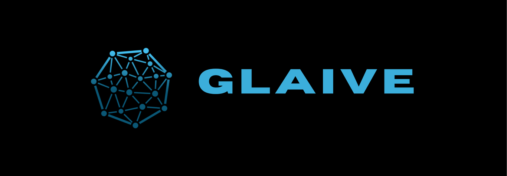
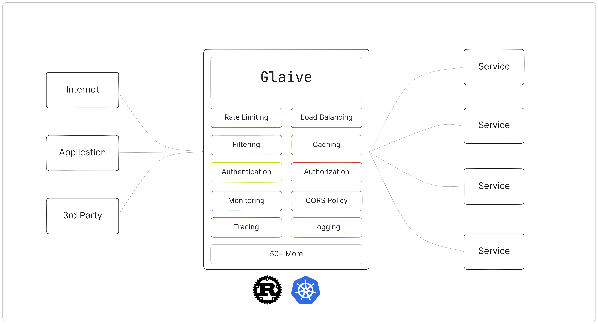

# About Glaive

Glaive in an API Gateway written in Rust, this is a gateway service that will fulfill your needs, it provides a simple configuration and some built in plugins to work with.
We aim the system to work perfectly and providing robust performance, resource usage, and security within a very simple configuration.

> [!WARNING]
> This project is a work-in-progress.

# Architecture Overview

Glaive capable of handling a bunch of systems in the backdoor from the outer world, it is capable of handling a static web, services, LLMs & more.

# Feature Highlights

* Support TLS over OpenSSL
* Support various of request: REST, gRPC, WebSocket, etc.
* Provide a simple & robust configurations.
* Built in with various plugins: Cache, Observability, Kubernetes, etc.

# System & Build Requirement

* Current Rust version: rustc 1.75.0
* Currently, it's only for Linux / Docker as alternative
* Make sure that [Perl 5] is installed on your system for OpenSSL

[Perl 5]:https://www.perl.org/

# Getting Started

> coming soon